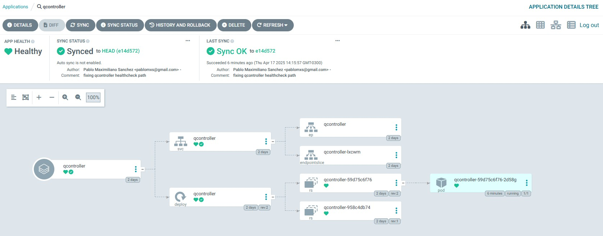
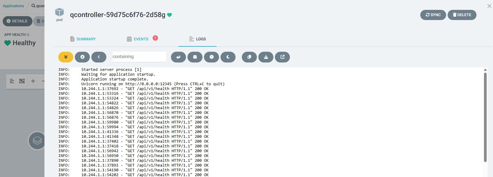

# QController API

This is a sample FastAPI application that demonstrates how to build a modular, containerized API capable of log ingestion, simple data classification, and basic observability using OpenTelemetry. It is intended as a learning and reference resource.

---

## Project Structure
```
.
├── Dockerfile
├── README
├── app
│   ├── __init__.py
│   ├── main.py                 # FastAPI entrypoint
│   ├── otel.py                 # OpenTelemetry instrumentation example
│   ├── qlogic
│   │   ├── __init__.py
│   │   ├── evaluator.py        # Evaluation logic
│   │   ├── parser.py           # Parsing logic
│   │   └── sensors
│   │       ├── _registry.py    # Registry for supported sensors
│   │       ├── humidistat.py   # Humidistat evaluation rules
│   │       └── thermometer.py  # Thermometer evaluation rules
│   └── routes_v1.py            # HTTP endpoints
├── requirements.txt
└── sample_log
    └── sensors.log             # Example log
```

## Setup Instructions

The API can be run either locally using uvicorn, or in a Docker container.

### Option 1: Run with Docker

**Requirements:**
- Docker installed and running.

**Steps:**

1. Pull the image from Docker Hub:
```
docker pull pablomxs/qcontroller-api
```
2. Run the container:
```
docker run -p 12345:12345 pablomxs/qcontroller-api
```
3. Access the API interactive docs:
Open your browser and go to: http://localhost:12345/docs

### Option 2: Run Locally with Uvicorn

**Requirements:**
- Python 3.12+
- `pip`
- (Optional but recommended) A virtual environment tool such as `venv`

**Steps:**
1. Clone the repository:
```
git clone https://github.com/pablomxs/qcontroller.git
cd qcontroller
```
2. Create a virtual environment and activate it:
```
python3 -m venv .venv
source .venv/bin/activate
```
3. Install dependencies:
```
pip install -r requirements.txt
```
4. Run the API using uvicorn:
```
uvicorn app.main:app --reload --host 0.0.0.0 --port 12345
```
5. Access the API interactive docs:
Open your browser and go to: http://localhost:12345/docs

## Dependencies

The project uses a small number of core libraries for basic functionality. Additional packages are included only for optional observability features.

### Core Requirements

```
fastapi==0.115.1
uvicorn==0.34.0
python-multipart==0.0.20
```

### Optional Observability

```
# opentelemetry-api==1.32.0
# opentelemetry-sdk==1.32.0
# opentelemetry-exporter-otlp-proto-grpc==1.32.0
# opentelemetry-instrumentation-fastapi==0.53b0
# opentelemetry-instrumentation-requests==0.53b0
# python-dotenv==1.1.0
```

---

## API Usage

Once running, interact with the API using the Swagger docs: http://localhost:12345/docs

#### `POST /evaluate`

This is the main endpoint. Use it to upload a sensor log file and receive the evaluation results.

- **Content-Type:** `multipart/form-data`
- **Field:** `file` – Upload a `.log` file here
- **Response:** JSON with evaluation results

#### `GET /health`

Basic health check endpoint used for availability monitoring. It can also be useful when deploying to Kubernetes (for readiness/liveness probes) or integrating with monitoring platforms.

---

## Observability

The project includes optional OpenTelemetry instrumentation. When enabled, it exports:

- **Traces** (for request lifecycle and latency analysis)
- **Metrics** (e.g., request counts, response times)
- **Logs** (structured log forwarding)

If an .env file is configured like the sample below and uncomment the instrumentation code, signals can be sent to observability platforms like New Relic:

```
OTEL_EXPORTER_OTLP_ENDPOINT=https://otlp.nr-data.net
OTEL_EXPORTER_OTLP_HEADERS=api-key=REPLACE_WITH_LICENSE_KEY
OTEL_SERVICE_NAME=qcontroller-api
```

---

## Ideas for Expansion

- Switch to structured log format (e.g., JSON) for easier streaming and processing
- Use queue ingestion with Kafka, RabbitMQ, or Azure Service Bus
- Persist results using a relational DB (e.g., PostgreSQL) or document store
- Add API authentication via OAuth2 or JWT
- Write automated tests to validate key components

---

## Kubernetes Readiness

This project was successfully deployed to Kubernetes using a Helm chart and ArgoCD to validate readiness in a production-style environment.



