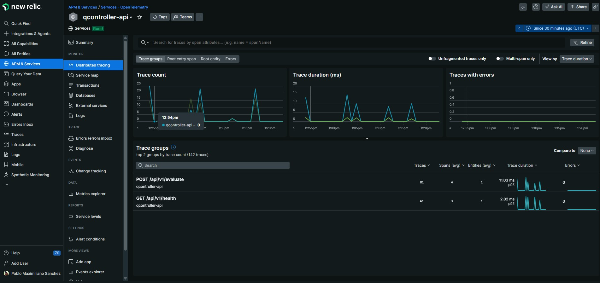
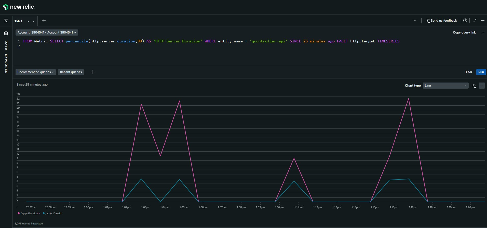
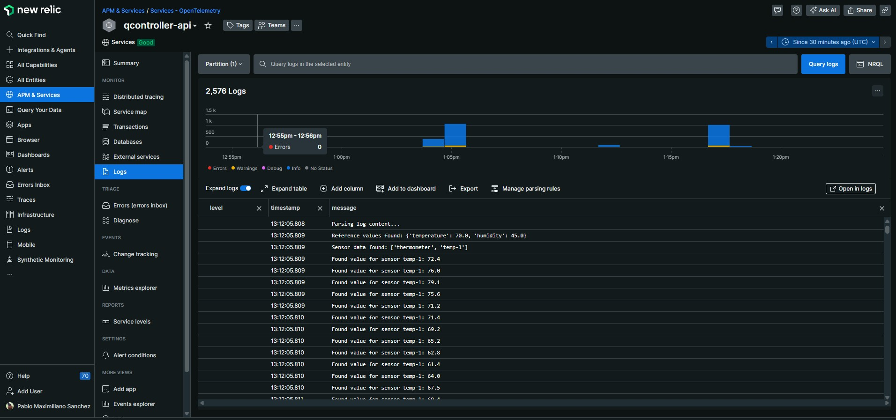

# QController API

This project implements a quality control system for evaluating sensor data and determining its classification based on predefined rules. It is built using FastAPI.

---

## Approach

I decided to build this as an API instead of a CLI script to provide a more scalable, flexible, and integration-friendly solution. APIs are easier to consume both programmatically and interactively (e.g., through a web form), and they are a natural fit in modern, containerized microservice environments. This approach also opens the door to enhancements like queue-based processing, health checks, and horizontal scaling.

To implement the API, I chose FastAPI because it's a modern Python framework that’s actively maintained, well-documented, and offers excellent developer experience out-of-the-box (e.g., with auto-generated docs via Swagger UI).

I began by building something functional: setting up the core FastAPI app, writing a basic log parser, and implementing the sensor evaluation rules. Once I had the core working, I moved into modularizing the code for clarity and maintainability:
- Separated parsing, evaluation, and classification into different modules
- Used a sensor registry to make it easier to add new sensor types without modifying the evaluation logic
- Instrumented the app with OpenTelemetry to expose observability signals (traces, logs, and metrics) to New Relic just as an example

---

## Project Structure
```
.
├── Dockerfile
├── README
├── app
│   ├── __init__.py
│   ├── main.py                 # FastAPI entrypoint
│   ├── otel.py                 # OpenTelemetry instrumentation example
│   ├── qlogic
│   │   ├── __init__.py
│   │   ├── evaluator.py        # Evaluation logic
│   │   ├── parser.py           # Parsing logic
│   │   └── sensors
│   │       ├── _registry.py    # Registry for supported sensors
│   │       ├── humidistat.py   # Humidistat evaluation rules
│   │       └── thermometer.py  # Thermometer evaluation rules
│   └── routes_v1.py            # HTTP endpoints
├── requirements.txt
└── sample_log
    └── sensors.log             # Example log
```

## Setup Instructions

You can run the API either locally using uvicorn, or in a Docker container. Below are the setup steps for both options.

### Option 1: Run with Docker

**Requirements:**
- Docker installed and running.

**Steps:**

1. Pull the image from Docker Hub:
```
docker pull pablomxs/qcontroller-api
```
2. Run the container:
```
docker run -p 12345:12345 pablomxs/qcontroller-api
```
3. Access the API interactive docs:
Open your browser and go to: http://localhost:12345/docs

### Option 2: Run Locally with Uvicorn

**Requirements:**
- Python 3.12+
- `pip` or `pipenv`
- (Optional but recommended) A virtual environment tool such as `venv`

**Steps:**
1. Clone the repository:
```
git clone https://github.com/pablomxs/qcontroller.git
cd qcontroller
```
2. Create a virtual environment and activate it:
```
python3 -m venv .venv
source .venv/bin/activate
```
3. Install dependencies:
```
pip install -r requirements.txt
```
4. Run the API using uvicorn:
```
uvicorn app.main:app --reload --host 0.0.0.0 --port 12345
```
5. Access the API interactive docs:
Open your browser and go to: http://localhost:12345/docs

## Dependencies

The project uses a small number of core libraries for basic functionality. Additional packages are included only for optional observability features.

### Core Requirements

These are the only packages required to run the app:

```
fastapi==0.115.1
uvicorn==0.34.0
python-multipart==0.0.20
```

These dependencies are enough to run the /evaluate endpoint and use the API normally via Swagger UI or HTTP clients.

---

## Usage

Once the API is running, you can interact with it using Swagger UI at: http://localhost:12345/docs


### Endpoints

#### `POST /evaluate`

This is the main endpoint. Use it to upload a sensor log file and receive the evaluation results.

- **Content-Type:** `multipart/form-data`
- **Field:** `file` – Upload your `.log` file here
- **Response:** JSON with evaluation results

#### `GET /health`

Basic health check endpoint used for availability monitoring. It can also be useful when deploying to Kubernetes (for readiness/liveness probes) or integrating with monitoring platforms.

---

## Observability

As part of demonstrating production-readiness and observability best practices, this project includes sample code for instrumentation using OpenTelemetry to expose:

- **Traces** (for request lifecycle and latency analysis)
- **Metrics** (e.g., request counts, response times)
- **Logs** (structured log forwarding)

All of this can be exported to observability platforms. In this project, I set up integration with New Relic as an example.

### Example Screenshots (New Relic)

Below are a few screenshots from my observability test setup:

*Traces sent to New Relic*



*Metrics collected via OpenTelemetry SDK*



*Logs forwarded to New Relic*



> Note: Observability features are commented out in the version submitted to keep the setup simple.

---

## Suggestions for Improvement

**Redesign the log format**:  
Instead of relying on positional line structure (like `reference`, `sensor`, `value`), we should consider using a structured format (e.g., JSON or CSV) where each line includes all necessary fields (`sensor_type`, `sensor_id`, `timestamp`, `value`, etc.).

This change would allow the logs to be ingested from unordered or parallel sources. It also makes it easier to stream logs from multiple environments into a centralized pipeline in a Pub/Sub model. With this approach we can also enable processing without the need to maintain context across multiple lines.

**Implement queue-based ingestion**:
To improve scalability and enable real-time processing, the system could be adapted to consume log data from a message queue instead of relying on file uploads. This would allow the evaluator service to subscribe to a centralized stream of messages, using technologies such as RabbitMQ, Kafka, or Azure Service Bus.

**Add persistent storage (database integration)**:  
We can add a relational database to persist sensor evaluations, logs, and configurations. This would allow the system to store historical results, dynamically manage sensor types and update classification thresholds without requiring code changes. It also enables future enhancements like an admin interface for configuration and auditing.

**Authentication & Authorization**:
Implement token-based authentication to secure the API and restrict access to protected endpoints, so we can ensure only authorized clients can interact with sensitive functionalities/endpoints.

**Automated Testing**:
Add unit and integration tests to validate core functionality like log parsing and sensor classification.
